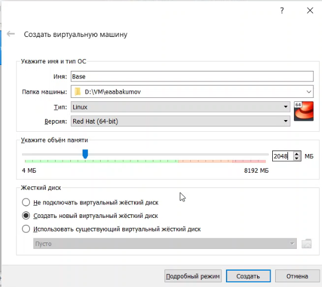
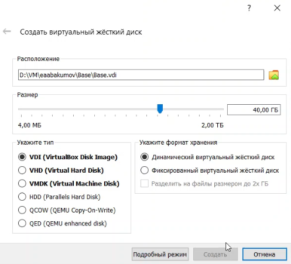
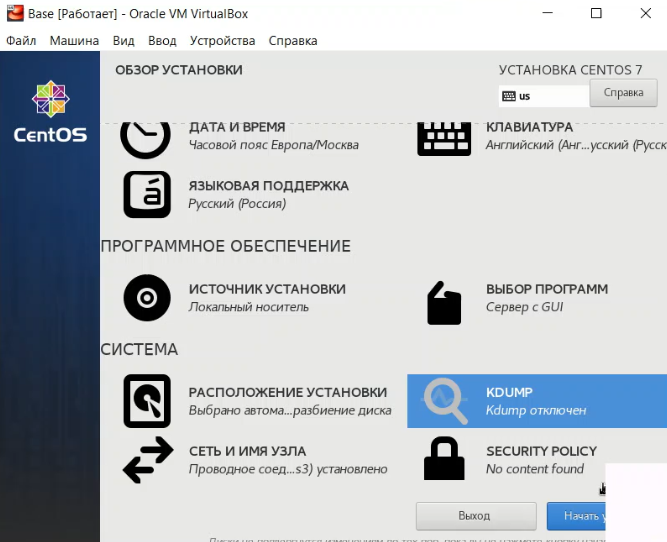
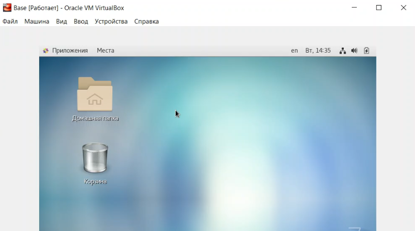
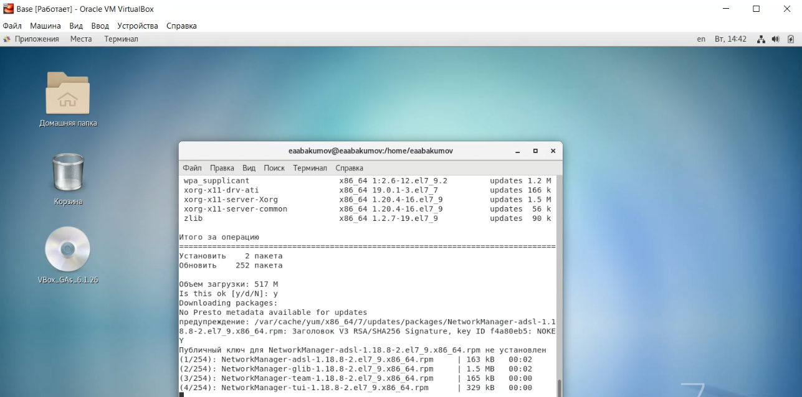
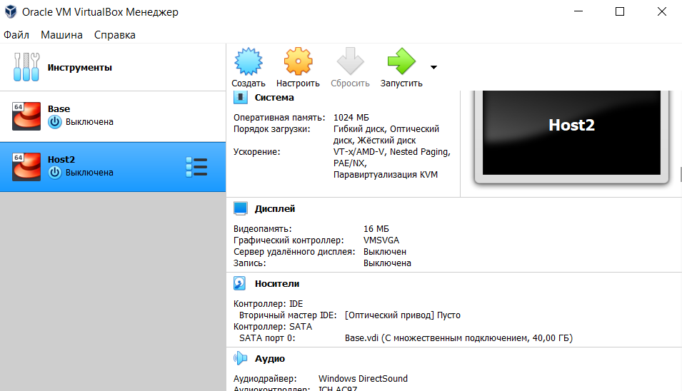

---
## Front matter
lang: ru-RU
title: "Лабораторная работа № 1"
subtitle: "Установка и конфигурация операционной системы на виртуальную машину"
author: "Абакумов Егор Александрович"

## Formatting
toc: false
slide_level: 2
theme: metropolis
header-includes: 
 - \metroset{progressbar=frametitle,sectionpage=progressbar,numbering=fraction}
 - '\makeatletter'
 - '\beamer@ignorenonframefalse'
 - '\makeatother'
aspectratio: 43
section-titles: true
---

## Цель работы

Приобретение практических навыков установки операционной системы на виртуальную машину, настройки минимально необходимых для дальнейшей работы сервисов.

# Ход работы

## Подготовка окружения

{ #fig:001 width=72% }

## Подготовка окружения

{ #fig:002 width=72% }

## Конфигурация параметров ОС

{ #fig:003 width=72% }

## Результат установки

{ #fig:004 width=72% }

## Обновление ПО

{ #fig:005 width=72% }

## Вторая машина

{ #fig:006 width=72% }

## Вывод

В ходе работы была успешно установлена и сконфигурирована ОС CentOS для дальнейшей работы.