---
# Front matter
lang: ru-RU
title: "Лабораторная работа № 1"
subtitle: "Установка и конфигурация операционной системы на виртуальную машину"
author: "Абакумов Егор Александрович"

# Formatting
toc-title: "Содержание"
toc: true
toc_depth: 2
lof: true
lot: true
fontsize: 12pt
linestretch: 1.5
papersize: a4paper
documentclass: scrreprt
polyglossia-lang: russian
polyglossia-otherlangs: english
mainfont: PT Serif
romanfont: PT Serif
sansfont: PT Sans
monofont: PT Mono
mainfontoptions: Ligatures=TeX
romanfontoptions: Ligatures=TeX
sansfontoptions: Ligatures=TeX,Scale=MatchLowercase
monofontoptions: Scale=MatchLowercase
indent: true
pdf-engine: lualatex
header-includes:
  - \linepenalty=10
  - \interlinepenalty=0
  - \hyphenpenalty=50
  - \exhyphenpenalty=50
  - \binoppenalty=700
  - \relpenalty=500
  - \clubpenalty=150
  - \widowpenalty=150
  - \displaywidowpenalty=50
  - \brokenpenalty=100
  - \predisplaypenalty=10000
  - \postdisplaypenalty=0
  - \floatingpenalty = 20000
  - \raggedbottom
  - \usepackage{float}
  - \floatplacement{figure}{H}
---

# Цель работы

Приобретение практических навыков установки операционной системы на виртуальную машину, настройки минимально необходимых для дальнейшей работы сервисов.

# Задание

Установить ОС CentOS на виртуальную машину и провести начальную конфигурацию.

# Ход работы

1. Для установки нам потребуется непосредственно сам дистрибутив CentOS 7 и среда VirtualBox. Скачиваем и запускаем последнюю. Тут меняем папку установки на соответствующую рекомендациям (иллюстр. @fig:001) и создаем новую Linux RedHat x64 виртуальную машину со следующими настройками (илллюстр. @fig:002, @fig:003) и  проверяем папку для снимков (иллюстр. @fig:004).

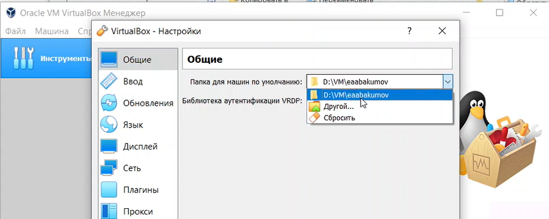{ #fig:001 width=73% }

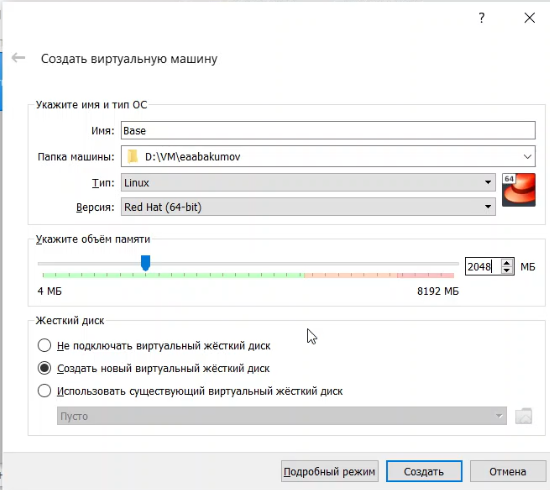{ #fig:002 width=73% }

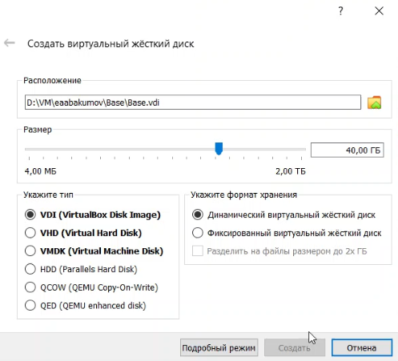{ #fig:003 width=73% }

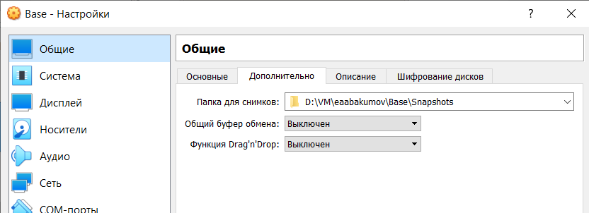{ #fig:004 width=73% }

2. Далее подключаем образ диска для установки (иллюстр. @fig:005) и запускаем машину для установки ОС (иллюстр. @fig:006).

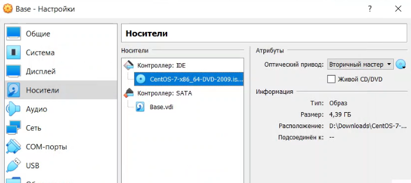{ #fig:005 width=73% }

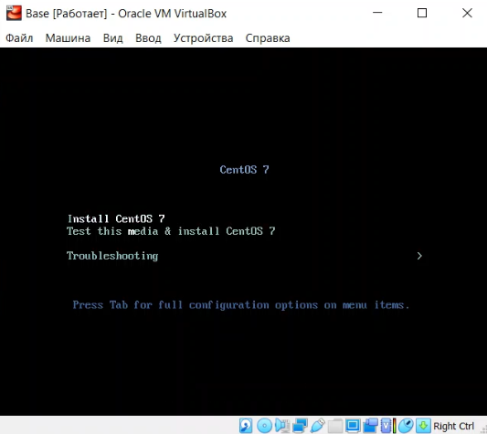{ #fig:006 width=73% }

3. Проводим конфигурацию параметров будущей ОС в соответствии с требованиями, задаем тут язык, подключаем сеть, отключаем KDUMP, выбираем пакет сервера с GUI и минимальную среду разработки, определяем наш созданный диск и запускаемся (иллюстр. @fig:007). Далее нам нужно создать пользователя с правами администратора и задать пароль на root права (иллюстр. @fig:008). Ждем завершения процесса.

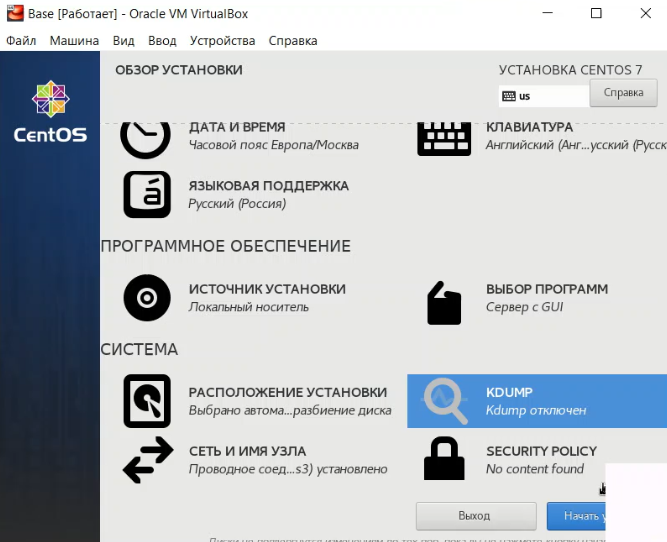{ #fig:007 width=73% }

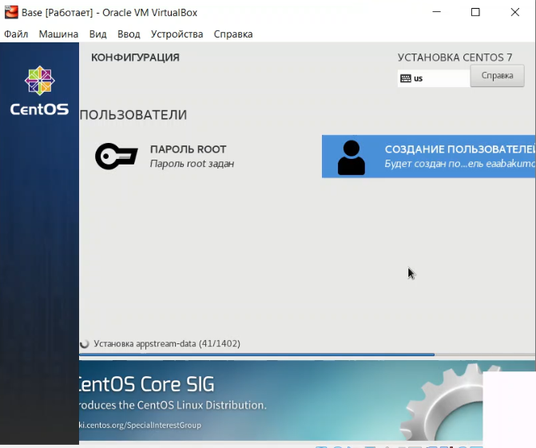{ #fig:008 width=73% }

4. После завершения установки принимаем лицензию, перезагружаемся и входим в учетную запись (иллюстр. @fig:009). Здесь подключим образ дополнений гостевой ОС и установим необходимый пакет драйверов (иллюстр. @fig:010)

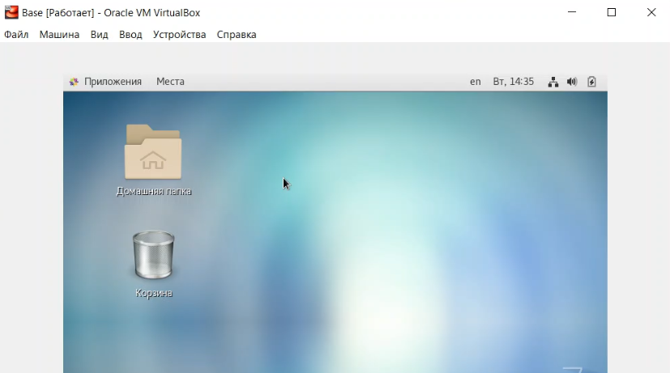{ #fig:009 width=73% }

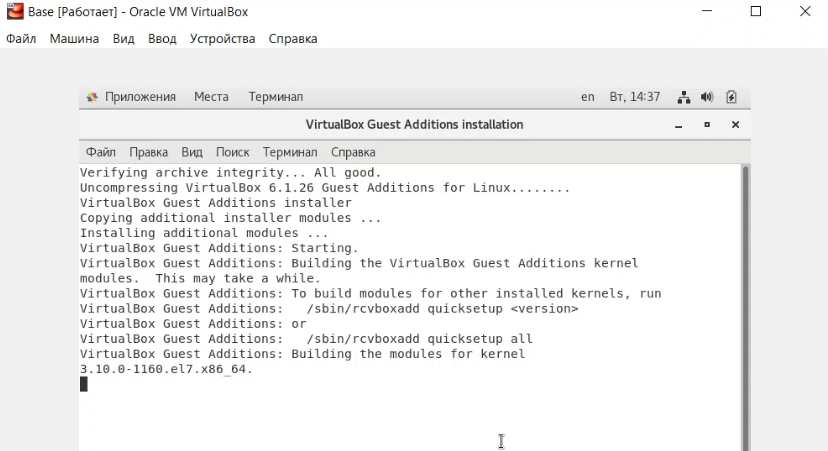{ #fig:010 width=73% }

5. Теперь выполним команду "yum update" для обновления всего ПО в системе (иллюстр. @fig:011).

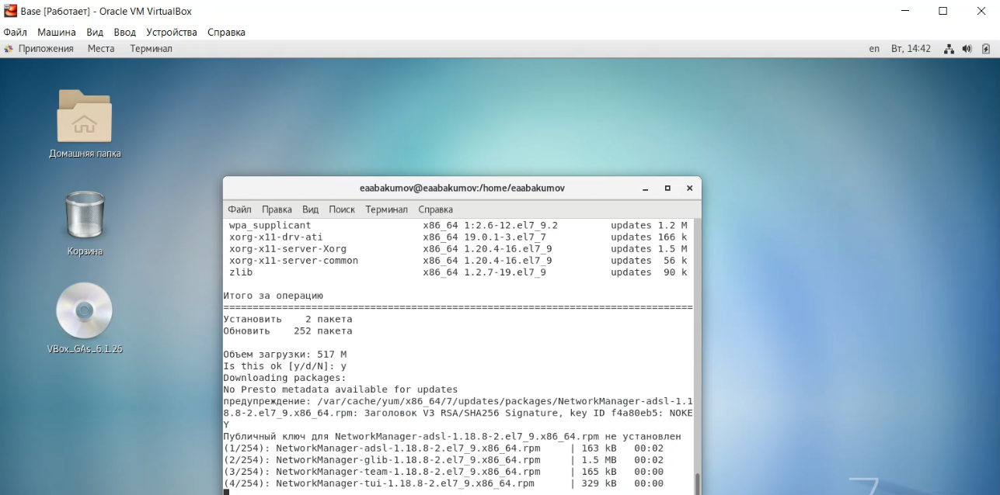{ #fig:011 width=73% }

6. Далееот машины Base открепялем виртуальный жесткий диск (иллюстр. @fig:012) и на его основе создаем еще одну машину Host2 (иллюстр. @fig:013).

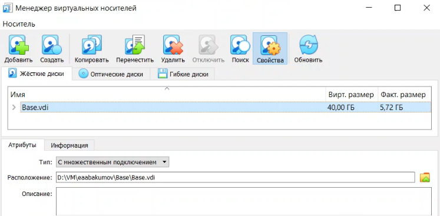{ #fig:012 width=73% }

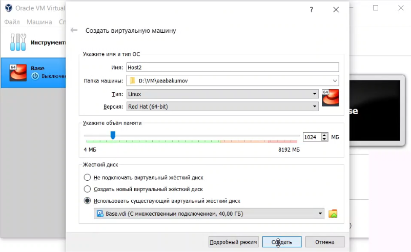{ #fig:013 width=73% }

# Выводы

В ходе работы мы успешно приобрели практические навыки установки операционной системы на виртуальную машину и настройки минимально необходимых для дальнейшей работы сервисов.