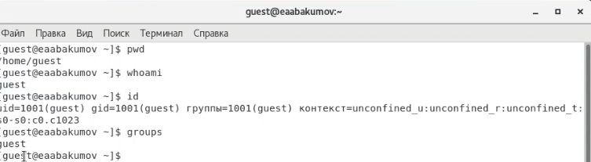
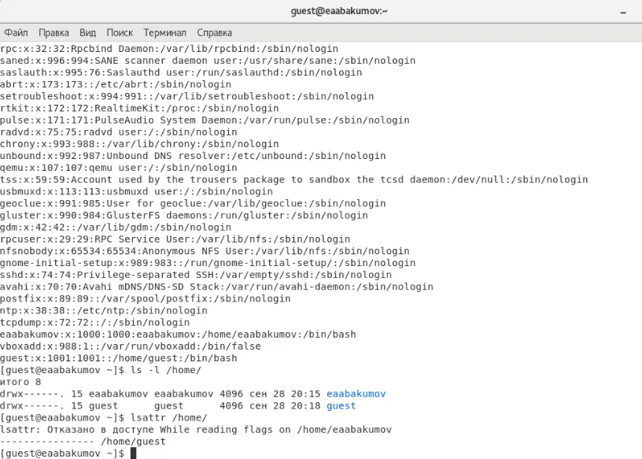
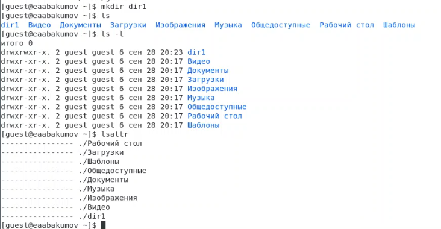
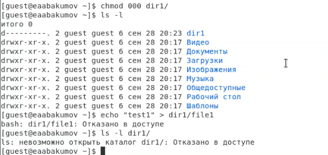
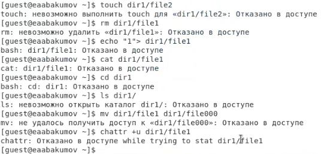
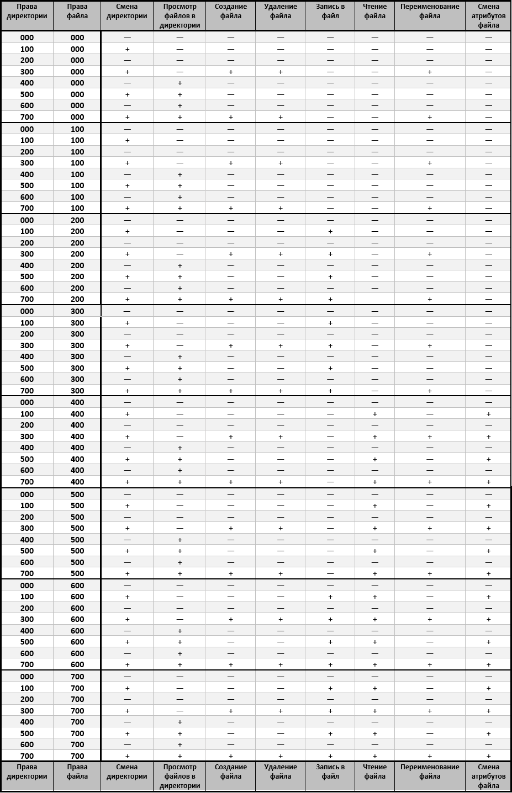
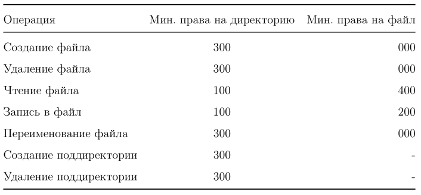

---
## Front matter
lang: ru-RU
title: "Лабораторная работа № 2"
subtitle: "Дискреционное разграничение прав в Linux. Основные атрибуты"
author: "Абакумов Егор Александрович"

## Formatting
toc: false
slide_level: 2
theme: metropolis
header-includes: 
 - \metroset{progressbar=frametitle,sectionpage=progressbar,numbering=fraction}
 - '\makeatletter'
 - '\beamer@ignorenonframefalse'
 - '\makeatother'
aspectratio: 43
section-titles: true
---

## Цель работы

Получение практических навыков работы в консоли с атрибутами файлов, закрепление теоретических основ дискреционного разграничения доступа в современных системах с открытым кодом на базе ОС Linux.

# Ход работы

## Изучение данных о пользователе

{ #fig:001 width=72% }

## Изучение данных о пользователе

{ #fig:002 width=72% }

## Создание новой директории и проверка прав

{ #fig:003 width=72% }

## Изменение прав и попытка создания файла

{ #fig:004 width=72% }

## Последовательность действий для проверки прав

{ #fig:005 width=72% }

## Таблица "Установленные права и разрешённые действия"

{ #fig:006 width=72% }

## Таблица "Минимальные права для совершения операций"

{ #fig:007 width=72% }

## Вывод

В ходе работы были успешно получены практические навыки работы в консоли с атрибутами файлов, закреплены теоретические основы дискреционного разграничения доступа в современных системах с открытым кодом на базе ОС Linux.
