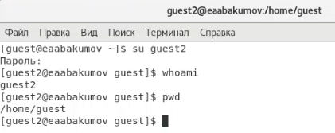

---
# Front matter
lang: ru-RU
title: "Лабораторная работа № 3"
subtitle: "Дискреционное разграничение прав в Linux. Два пользователя"
author: "Абакумов Егор Александрович"

# Formatting
toc-title: "Содержание"
toc: true
toc_depth: 2
lof: true
lot: true
fontsize: 12pt
linestretch: 1.5
papersize: a4paper
documentclass: scrreprt
polyglossia-lang: russian
polyglossia-otherlangs: english
mainfont: PT Serif
romanfont: PT Serif
sansfont: PT Sans
monofont: PT Mono
mainfontoptions: Ligatures=TeX
romanfontoptions: Ligatures=TeX
sansfontoptions: Ligatures=TeX,Scale=MatchLowercase
monofontoptions: Scale=MatchLowercase
indent: true
pdf-engine: lualatex
header-includes:
  - \linepenalty=10
  - \interlinepenalty=0
  - \hyphenpenalty=50
  - \exhyphenpenalty=50
  - \binoppenalty=700
  - \relpenalty=500
  - \clubpenalty=150
  - \widowpenalty=150
  - \displaywidowpenalty=50
  - \brokenpenalty=100
  - \predisplaypenalty=10000
  - \postdisplaypenalty=0
  - \floatingpenalty = 20000
  - \raggedbottom
  - \usepackage{float}
  - \floatplacement{figure}{H}
---

# Цель работы

Получение практических навыков работы в консоли с атрибутами файлов для групп пользователей.

# Задание

Провести эксперимент по выявлению минимально необходимых прав для совершения различных действий для групп пользователей.

# Теоретическое описание

В операционной системе Linux есть много отличных функций безопасности, но она из самых важных - это система прав доступа к файлам. Linux, как последователь идеологии ядра Linux в отличие от Windows, изначально проектировался как многопользовательская система, поэтому права доступа к файлам в linux продуманы очень хорошо.

Изначально каждый файл имел три параметра доступа [1]:

+ Чтение - разрешает получать содержимое файла, но на запись нет. Для каталога позволяет получить список файлов и каталогов, расположенных в нем;
+ Запись - разрешает записывать новые данные в файл или изменять существующие, а также позволяет создавать и изменять файлы и каталоги;
+ Выполнение - вы не можете выполнить программу, если у нее нет флага выполнения. Этот атрибут устанавливается для всех программ и скриптов, именно с помощью него система может понять, что этот файл нужно запускать как программу.

Каждый файл имеет три категории пользователей, для которых можно устанавливать различные сочетания прав доступа:

+ Владелец - набор прав для владельца файла, пользователя, который его создал или сейчас установлен его владельцем. Обычно владелец имеет все права, чтение, запись и выполнение.
+ Группа - любая группа пользователей, существующая в системе и привязанная к файлу. Но это может быть только одна группа и обычно это группа владельца, хотя для файла можно назначить и другую группу.
+ Остальные - все пользователи, кроме владельца и пользователей, входящих в группу файла.

Для управления правами используется команда chmod. При использовании chmod вы можете устанавливать разрешения для пользователя (user), группы (group) и других (other). Вы можете использовать эту команду в двух режимах: относительный режим и абсолютный режим. В абсолютном режиме три цифры используются для установки основных разрешений [2].

# Ход работы

1. Создаем в ОС двух новых пользователей guest и guest2. Так как первый у нас уже был, нам нужен всего один. Задаем ему пароль и добавляем его в группу guest (иллюстр. [-@fig:001]). Командой pwd проверяем местонахождение консоли. Видим, что guest находится в своей домашней директории, о чем свидетельствует значок тильда в приглашении командной строки (иллюстр. [-@fig:002]). Guest2 же находится в той же папке, однако для него она не домашняя, что показывает нам имя пользователя-владельца папки в приглашении командной строки (иллюстр. [-@fig:003]).

{ #fig:001 width=73% }

{ #fig:002 width=73% }

{ #fig:003 width=73% }

2. Проверяем командами id, id -G, id -Gn и groups к каким группам принадлежат пользователи. Видим, что guest входит только в группу guest, а guest2 входит и в группу guest, и в группу guest2 (иллюстр. [-@fig:004], [-@fig:005]).

{ #fig:004 width=73% }

{ #fig:005 width=73% }

3. Информация в файле /etc/groups так же соответствует полученным прежде данным, а именно guest в группе guest, а guest2 в группах guest и guest2 (иллюстр. [-@fig:006]). Регистрируем пользователя guest2 в группе guest (иллюстр. [-@fig:007]).

{ #fig:006 width=73% }

{ #fig:007 width=73% }

4. Изменяем права директории /home/guest, разрешив все действия для пользователей группы (иллюстр. [-@fig:008]). Снимаем все права c dir1 (иллюстр. [-@fig:009]).

{ #fig:008 width=73% }

{ #fig:009 width=73% }

5. Следующим шагом проведем эксперимент по выявлению минимально необходимых прав для действий над файловой структурой. Для этого используем нашу папку dir1, файлы внутри неё и функционал прав доступа OC Linux. Для каждой комбинации атрибутов доступа (r, w, x) на папку и на файл попробуем осуществить ряд действий и таким образом выявим минимально необходимые права для каждого действия. Атрибуты используем только для группы, поэтому комбинаций будет $2^3\cdot 2^3 = 2^6 = 64$. В каждой строчке будет по 8 действий. Проверять осуществимость функции будем следующими командами:
+ touch для создания файла в директории;
+ rm для удаления файла в директории;
+ echo для записи в файл;
+ cat для чтения из файла;
+ mv для переименования файла;
+ chattr для изменения атрибутов файла;
+ cd для смены директории;
+ ls для просмотра файлов в директории.

На иллюстрации можно увидеть вывод приведенных выше команд для первой строки таблицы (права на директорию - 000, права на файл - 000, иллюстр. [-@fig:0010]).

{ #fig:0010 width=73% }

Для ускорения ввода команд используем два скрипта для пользователей guest и guest2 соответственно (иллюстр. [-@fig:0011], [-@fig:0012]).

{ #fig:0011 width=73% }

{ #fig:0012 width=73% }

Полученные результаты представлены в виде таблицы (иллюстр. [-@fig:0013]).

{ #fig:0013 width=73% }

Таблица прав из данной работы и аналогичная таблица из предыдущей весьма похожи и имеют четкие аналогии. Тем не менее, различия также присутствуют. 

На основе данных полученной выше таблицы построим вторую таблицу, иллюстрирующую минимально необходимые права для совершения определенных операций.

   |       Операция       |Мин. права на директорию| Мин. права на файл |
   |:-------------------- |:----------------------:| ------------------:|
   |    Создание файла    |           030          |        000         |
   |    Удаление файла    |           030          |        000         |
   |     Чтение файла     |           010          |        040         |
   |     Запись в файл    |           010          |        020         |
   | Переименование файла |           030          |        000         |
   |Создание поддиректории|           030          |         -          |
   |Удаление поддиректории|           030          |         -          |

# Выводы

В ходе работы мы успешно провели эксперимент по выявлению минимально необходимых прав для действий над файловой структурой и получили ряд практических навыков работы в консоли с атрибутами файлов для групп пользователей.

# Список литературы

1. Права доступа к файлам в linux. // Losst. 2020. URL: https://losst.ru/prava-dostupa-k-fajlam-v-linux (дата обращения 11.10.2021).

2. Права в Linux (chown, chmod, SUID, GUID, sticky bit, ACL, umask). // habr.com. 2019. URL: https://habr.com/ru/post/469667/ (дата обращения 11.10.2021).

3. Д. С. Кулябов, А. В. Королькова, М. Н. Геворкян. Информационная безопасность компьютерных сетей: лабораторные работы. // Факультет физико-математических и естественных наук. M.: РУДН, 2015. 64 с..