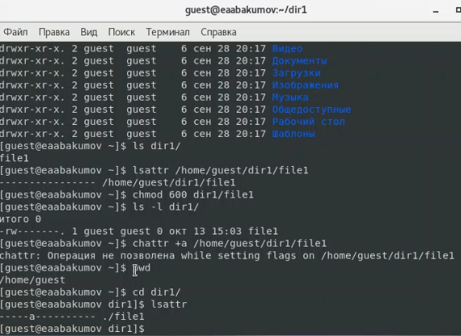
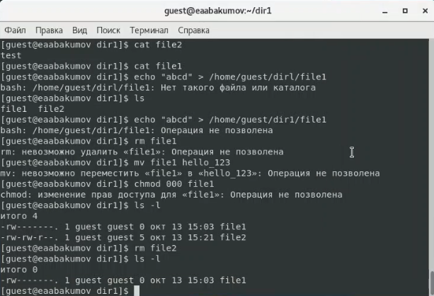
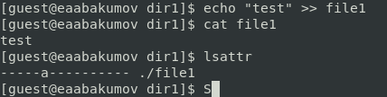
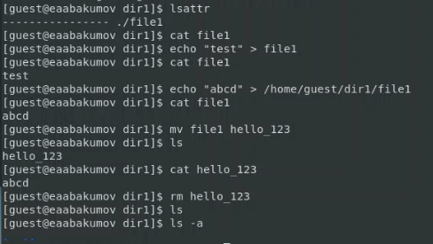
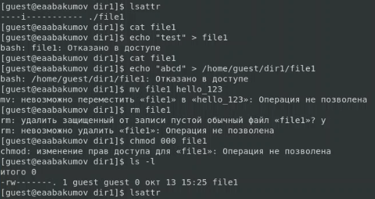
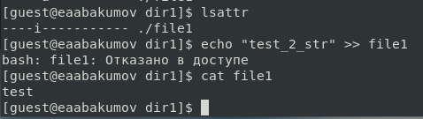

---
## Front matter
lang: ru-RU
title: "Лабораторная работа № 4"
subtitle: "Дискреционное разграничение прав в Linux. Расширенные атрибуты"
author: "Абакумов Егор Александрович"

## Formatting
toc: false
slide_level: 2
theme: metropolis
header-includes: 
 - \metroset{progressbar=frametitle,sectionpage=progressbar,numbering=fraction}
 - '\makeatletter'
 - '\beamer@ignorenonframefalse'
 - '\makeatother'
aspectratio: 43
section-titles: true
---

## Цель работы

Получение практических навыков работы в консоли с атрибутами файлов для групп пользователей.

# Ход работы

## Проверка и настройка атрибута "а"

{ #fig:001 width=72% }

## Проверка доступа на действия с атрибутом "а"

{ #fig:002 width=72% }

## Дозапись в файл с атрибутом "а"

{ #fig:003 width=72% }

## Проверка доступа на действия без всех атрибутов

{ #fig:004 width=72% }

## Проверка доступа на действия с атрибутом "i"

{ #fig:005 width=72% }

## Дозапись в файл с атрибутом "i"

{ #fig:006 width=72% }

## Вывод

В ходе работы были успешно получены практические навыки работы в консоли с атрибутами файлов для групп пользователей.
