---
# Front matter
lang: ru-RU
title: "Лабораторная работа № 4"
subtitle: "Дискреционное разграничение прав в Linux. Расширенные атрибуты"
author: "Абакумов Егор Александрович"

# Formatting
toc-title: "Содержание"
toc: true
toc_depth: 2
lof: true
lot: true
fontsize: 12pt
linestretch: 1.5
papersize: a4paper
documentclass: scrreprt
polyglossia-lang: russian
polyglossia-otherlangs: english
mainfont: PT Serif
romanfont: PT Serif
sansfont: PT Sans
monofont: PT Mono
mainfontoptions: Ligatures=TeX
romanfontoptions: Ligatures=TeX
sansfontoptions: Ligatures=TeX,Scale=MatchLowercase
monofontoptions: Scale=MatchLowercase
indent: true
pdf-engine: lualatex
header-includes:
  - \linepenalty=10
  - \interlinepenalty=0
  - \hyphenpenalty=50
  - \exhyphenpenalty=50
  - \binoppenalty=700
  - \relpenalty=500
  - \clubpenalty=150
  - \widowpenalty=150
  - \displaywidowpenalty=50
  - \brokenpenalty=100
  - \predisplaypenalty=10000
  - \postdisplaypenalty=0
  - \floatingpenalty = 20000
  - \raggedbottom
  - \usepackage{float}
  - \floatplacement{figure}{H}
---

# Цель работы

Получение практических навыков работы в консоли с расширенными атрибутами файлов.

# Задание

Провести практические занятия по взаимодействию с расширенными атрибутами файлов в OC Linux.

# Теоретическое описание

В операционной системе Linux есть много отличных функций безопасности, но она из самых важных - это система прав доступа к файлам. Linux, как последователь идеологии ядра Linux в отличие от Windows, изначально проектировался как многопользовательская система, поэтому права доступа к файлам в linux продуманы очень хорошо.

У каждого файла имеется определённый набор свойств в файловой системе. Например, это права доступа, владелец, имя, метки времени. В Linux каждый файл имеет довольно много свойств, например, права доступа устанавливаются трижды (для владельца, группы и всех прочих), метки времени также бывают трёх разных видов (время создание, доступа и изменения) [1].

Кроме того файлам и директориям могут быть установлены расширенные атрибуты доступа. Файловые атрибуты могут использовать администраторы и пользователи для защиты файлов от случайных удалений и изменений, а также их применяют злоумышленники, делая невозможным удаление вредоносного файла.

Для работы с этими атрибутами обычно используются утилиты chattr и lsattr, входящие в пакет e2fsprogs и предустановленные во всех современных дистрибутивах. Базовый синтаксис chattr выглядит следующим образом:

chattr options [operator][attributes] files

Вот некоторые доступные атрибуты:

a - файл может быть открыт только в режиме добавления;
A - не обновлять время перезаписи;
c - автоматически сжимать при записи на диск;
C - отключить копирование при записи;
D - работает только для папки, когда установлен, все изменения синхронно записываются на диск сразу же;
e - использовать extent'ы блоков для хранения файла;
i - сделать неизменяемым;
j - все данные перед записью в файл будут записаны в журнал;
s - безопасное удаление с последующей перезаписью нулями;
S - синхронное обновление, изменения файлов с этим атрибутом будут сразу же записаны на диск;
t - файлы с этим атрибутом не будут хранится в отдельных блоках;
u - содержимое файлов с этим атрибутом не будет удалено при удалении самого файла и потом может быть восстановлено.

Тем не менее, не стоит забывать, что вы не можете использовать chattr как меру безопасности так как атрибуты легко изменить. Один из способов решения этой проблемы - ограничить доступ к самой утилите chattr[2].

# Ход работы

1. Из-под пользователя guest проверяем расширенные атрибуты файла file1 командой lsattr, далее ставим права 600 на файл и пытаемся добавить атрибут "а" к файлу. Не получается, тогда делаем это из-под суперпользователя, проверяем (иллюстр. [-@fig:001], [-@fig:002]).

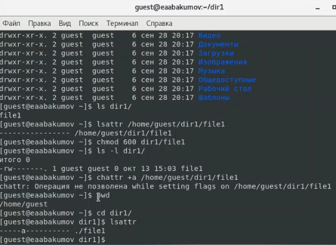{ #fig:001 width=73% }

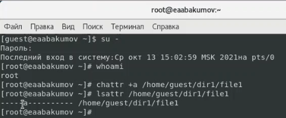{ #fig:002 width=73% }

2. Теперь командой echo пытаемся записать в файл текст, что у нас не выходит, не хватает прав (иллюстр. [-@fig:003]). Попытка перезаписать файл, удалить его или переименовать так же не приносит успеха - нет прав. Как и на изменение прав к файлу (иллюстр. [-@fig:004]). Однако дозаписывание в файл получается (иллюстр. [-@fig:011])

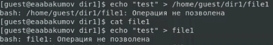{ #fig:003 width=73% }

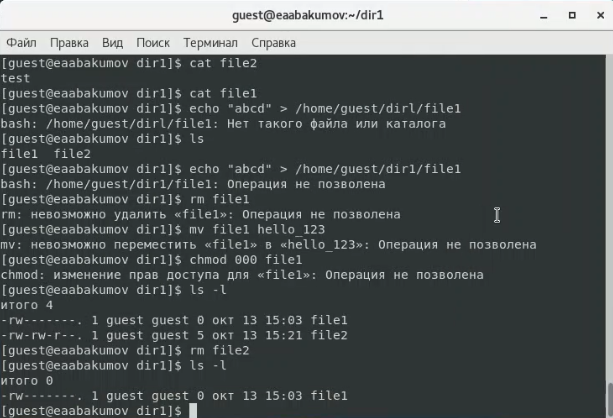{ #fig:004 width=73% }

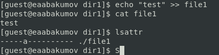{ #fig:011 width=73% }

3. Теперь снимаем атрибут "а" и пытаемся повторить все прошлые действия (иллюстр. [-@fig:005], [-@fig:006]). В этот раз у нас получается произвести все изменения штатно.

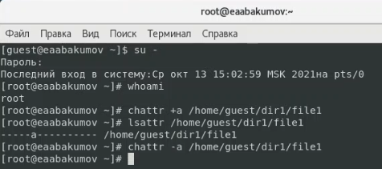{ #fig:005 width=73% }

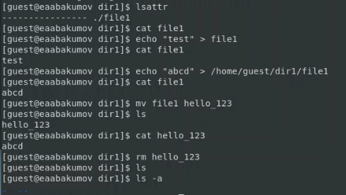{ #fig:006 width=73% }

4.  Попробуем то же самое для атрибута "i". В этот раз у нас так же не вышло сделать ни одного действия, даже дозаписывания (иллюстр. [-@fig:007], [-@fig:008], [-@fig:012])

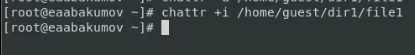{ #fig:007 width=73% }

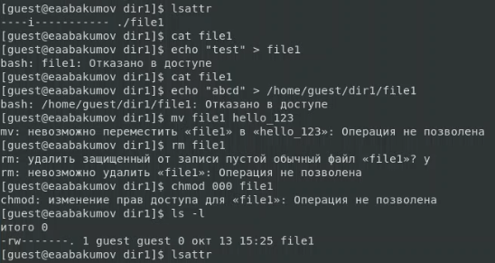{ #fig:008 width=73% }

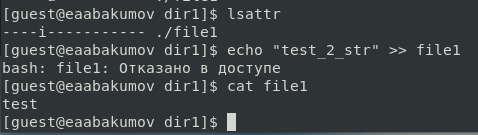{ #fig:012 width=73% }

5. Теперь уберем атрибут "i" и попробуем все действия еще раз. На этот раз без проблем, штатно (иллюстр. [-@fig:009], [-@fig:010]).

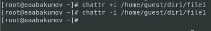{ #fig:009 width=73% }

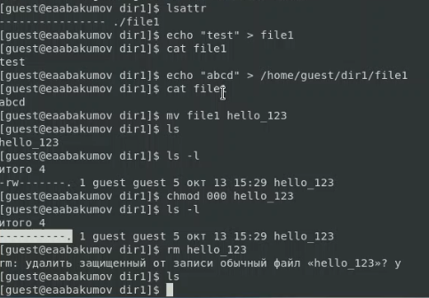{ #fig:010 width=73% }

# Выводы

В ходе работы мы успешно получили практические навыки работы в консоли с расширенными атрибутами файлов.

# Список литературы

1. Атрибуты файлов в Linux. // zalinux.ru. 2021. URL: https://zalinux.ru/?p=6440 (дата обращения 13.10.2021).

2. КОМАНДА CHATTR В LINUX. // Losst. 2020. URL: https://losst.ru/neizmenyaemye-fajly-v-linux (дата обращения 13.10.2021).

3. Д. С. Кулябов, А. В. Королькова, М. Н. Геворкян. Информационная безопасность компьютерных сетей: лабораторные работы. // Факультет физико-математических и естественных наук. M.: РУДН, 2015. 64 с..