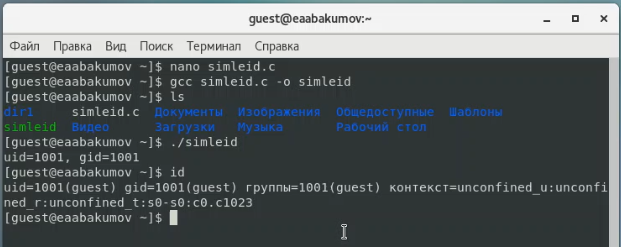
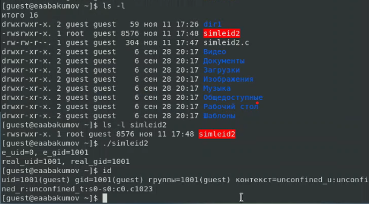
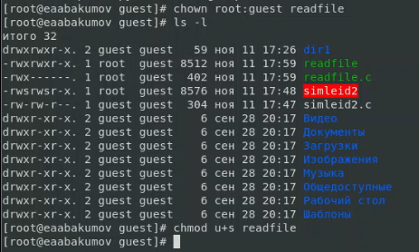
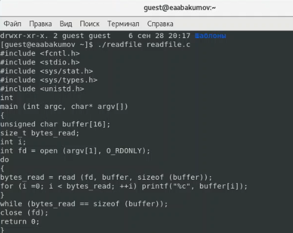
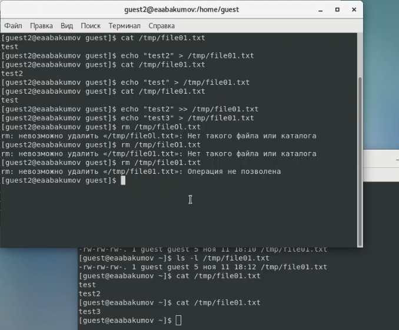
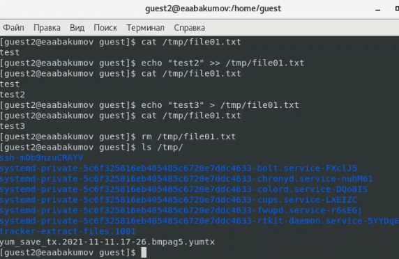

---
## Front matter
lang: ru-RU
title: "Лабораторная работа № 5"
subtitle: "Дискреционное разграничение прав в Linux. Исследование влияния дополнительных атрибутов"
author: "Абакумов Егор Александрович"

## Formatting
toc: false
slide_level: 2
theme: metropolis
header-includes: 
 - \metroset{progressbar=frametitle,sectionpage=progressbar,numbering=fraction}
 - '\makeatletter'
 - '\beamer@ignorenonframefalse'
 - '\makeatother'
aspectratio: 43
section-titles: true
---

## Цель работы

Изучение механизмов изменения идентификаторов, применения SetUID-, SetGID- и Sticky-битов. Получение практических навыков работы в консоли с дополнительными атрибутами. Рассмотрение работы механизма смены идентификатора процессов пользователей, а также влияние бита Sticky на запись и удаление файлов.

# Ход работы

## Создание и запуск первой программы

{ #fig:001 width=72% }

## Проверка и запуск усложненной программы

{ #fig:002 width=72% }

## Изменение прав на исходный файл программы readfile.c

{ #fig:003 width=72% }

## Изменение прав на исполняемый файл программы readfile

{ #fig:004 width=72% }

## Тестовый запуск команды readfile из-под guest

{ #fig:005 width=72% }

## Проверка файла со Sticky-битом

{ #fig:006 width=72% }

## Проверка файла без Sticky-бита

{ #fig:007 width=72% }

## Вывод

В ходе работы мы успешно изучили механизмы изменения идентификаторов, применения SetUID-, SetGID- и Sticky-битов, получили практические навыки работы в консоли с дополнительными атрибутами, рассмотрели принципы работы механизма смены идентификатора процессов пользователей, а также влияние бита Sticky на запись и удаление файлов.
