---
# Front matter
lang: ru-RU
title: "Лабораторная работа № 5"
subtitle: "Дискреционное разграничение прав в Linux. Исследование влияния дополнительных атрибутов"
author: "Абакумов Егор Александрович"

# Formatting
toc-title: "Содержание"
toc: true
toc_depth: 2
lof: true
lot: true
fontsize: 12pt
linestretch: 1.5
papersize: a4paper
documentclass: scrreprt
polyglossia-lang: russian
polyglossia-otherlangs: english
mainfont: PT Serif
romanfont: PT Serif
sansfont: PT Sans
monofont: PT Mono
mainfontoptions: Ligatures=TeX
romanfontoptions: Ligatures=TeX
sansfontoptions: Ligatures=TeX,Scale=MatchLowercase
monofontoptions: Scale=MatchLowercase
indent: true
pdf-engine: lualatex
header-includes:
  - \linepenalty=10
  - \interlinepenalty=0
  - \hyphenpenalty=50
  - \exhyphenpenalty=50
  - \binoppenalty=700
  - \relpenalty=500
  - \clubpenalty=150
  - \widowpenalty=150
  - \displaywidowpenalty=50
  - \brokenpenalty=100
  - \predisplaypenalty=10000
  - \postdisplaypenalty=0
  - \floatingpenalty = 20000
  - \raggedbottom
  - \usepackage{float}
  - \floatplacement{figure}{H}
---

# Цель работы

Изучение механизмов изменения идентификаторов, применения SetUID-, SetGID- и Sticky-битов. Получение практических навыков работы в консоли с дополнительными атрибутами. Рассмотрение работы механизма смены идентификатора процессов пользователей, а также влияние бита Sticky на запись и удаление файлов.

# Теоретическое описание

В операционной системе Linux есть много отличных функций безопасности, но она из самых важных - это система прав доступа к файлам. Linux, как последователь идеологии ядра Linux в отличие от Windows, изначально проектировался как многопользовательская система, поэтому права доступа к файлам в linux продуманы очень хорошо.

У каждого файла имеется определённый набор свойств в файловой системе. Например, это права доступа, владелец, имя, метки времени. В Linux каждый файл имеет довольно много свойств, например, права доступа устанавливаются трижды (для владельца, группы и всех прочих), метки времени также бывают трёх разных видов (время создание, доступа и изменения) [1].

Кроме того файлам и директориям могут быть установлены расширенные атрибуты доступа. Файловые атрибуты могут использовать администраторы и пользователи для защиты файлов от случайных удалений и изменений, а также их применяют злоумышленники, делая невозможным удаление вредоносного файла.

Для работы с этими атрибутами обычно используются утилиты chattr и lsattr, входящие в пакет e2fsprogs и предустановленные во всех современных дистрибутивах.

Для работы с правами используем команду chmod, синтаксис которой выглядит следующим образом:

chmod options permissions path_to_the_file

Сначала рассмотрим какими бывают права доступа linux и как они устанавливаются. Есть три основных вида прав:

r - чтение;
w - запись;
x - выполнение;
s - выполнение  от имени суперпользователя (дополнительный);

Также есть три категории пользователей, для которых вы можете установить эти права на файл linux:

u - владелец файла;
g - группа файла;
o - все остальные пользователи;
Синтаксис настройки прав такой:

группа_пользователей действие вид_прав

В качестве действий могут использоваться знаки "+" - включить или "-" - отключить [2].

Тем не менее, не стоит забывать, что вы не можете использовать chattr как меру безопасности так как атрибуты легко изменить. Один из способов решения этой проблемы - ограничить доступ к самой утилите chattr[3].

# Ход работы

1. Готовим систему и входим из-под guest'a. Пишем программу simpleid.c (иллюстр. [-@fig:001]). Компилируем программу, запускаем, видим вывод uid и gid пользователя, сравниваем вывод с id, всё так же (иллюстр. [-@fig:002]). 

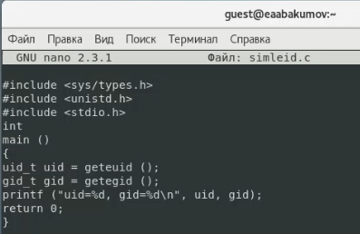{ #fig:001 width=73% }

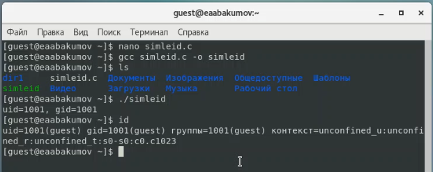{ #fig:002 width=73% }

2. Усложняем программу и запускаем её (иллюстр. [-@fig:003], [-@fig:004]). Из-под рута меняем владельца и добавляем SetUID бит на файл (иллюстр. [-@fig:005]). Проверяем правильность и запускаем программу еще раз. еuid возвращает id владельца, а real_uid возвращает uid запускающего пользователя (иллюстр. [-@fig:006]).

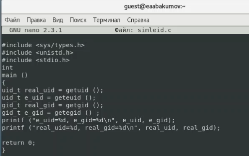{ #fig:003 width=73% }

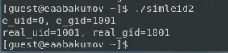{ #fig:004 width=73% }

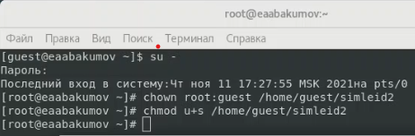{ #fig:005 width=73% }

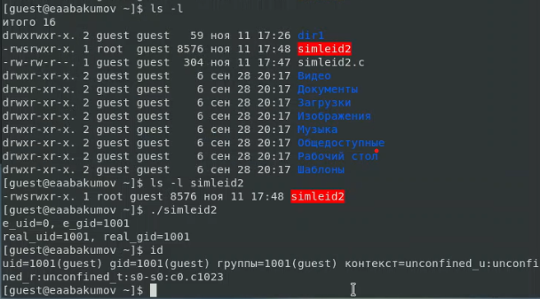{ #fig:006 width=73% }

3. Теперь добавим на файл SetGID бит с проделаем все то же самое (иллюстр. [-@fig:007], [-@fig:008]).

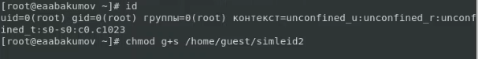{ #fig:007 width=73% }

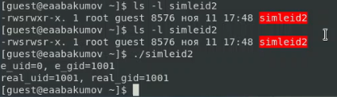{ #fig:008 width=73% }

4. Пишем программу readfile.c (иллюстр. [-@fig:009], [-@fig:010]).

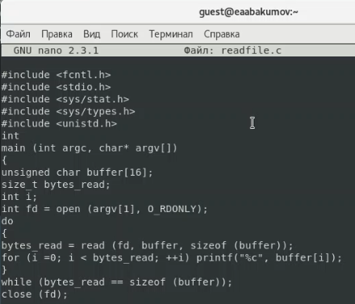{ #fig:009 width=73% }

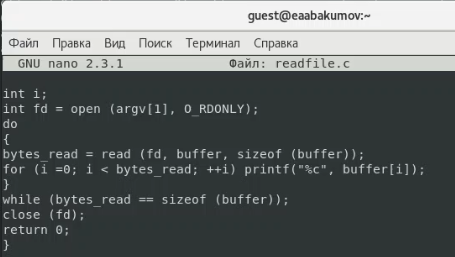{ #fig:010 width=73% }

5. Меняем владельца у файла readfile.c и запрещаем чтение всем, кроме суперпользователя (иллюстр. [-@fig:011]). Проверяем, что guest не может читать (иллюстр. [-@fig:012]). Меняем владельца у программы readfile и добавляем SetUID бит на неё (иллюстр. [-@fig:013]).

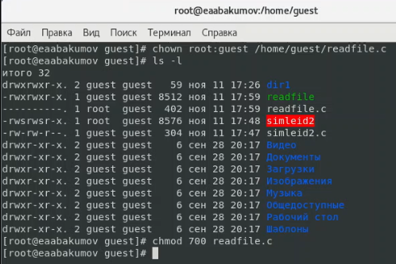{ #fig:011 width=73% }

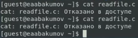{ #fig:012 width=73% }

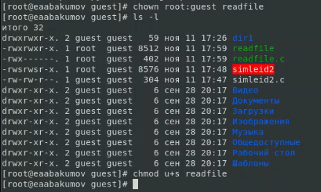{ #fig:013 width=73% }

6. Проверяем, может ли программа readfile прочитать файл readfile.c и файл /etc/shadow. Да, может (иллюстр. [-@fig:014], [-@fig:015]). Хотя сам пользователь вручную не мог. Всё дело в том, что при вызове программы права пользователя повышаются SetUID битом до прав владельца, который может читать файлы (суперпользователь в нашем случае).

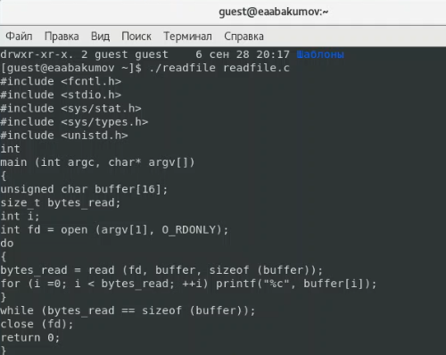{ #fig:014 width=73% }

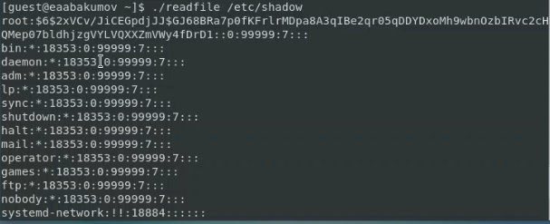{ #fig:015 width=73% }

7. Проверяем Sticky бит. Для этого создаем файл, которому даем rw права для others и пишем туда слово test (иллюстр. [-@fig:016]). Теперь пробуем выполнить дозапись в файл, перезапись файла и его удаление. Всё, кроме удаления, прошло успешно (иллюстр. [-@fig:017]).

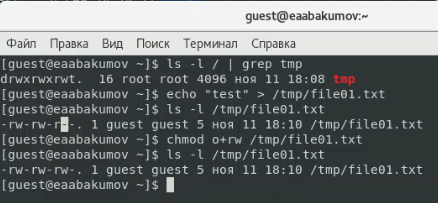{ #fig:016 width=73% }

{ #fig:017 width=73% }

8. Повышаем права до суперпользователя и удаляем Sticky-бит с папки /tmp (иллюстр. [-@fig:018]). Повторяем наши тесты. Теперь прошли все команды, включая удаление файла (иллюстр. [-@fig:019]). Таким образом, пользователь, не являющийся владельцем файла, смог его удалить, так как Sticky-бит не был настроен. Возвращаем Sticky-бит на папку /tmp.

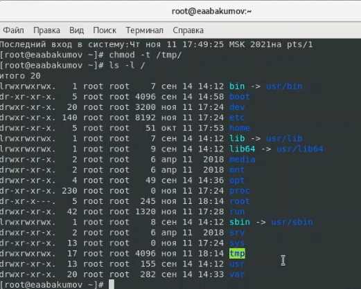{ #fig:018 width=73% }

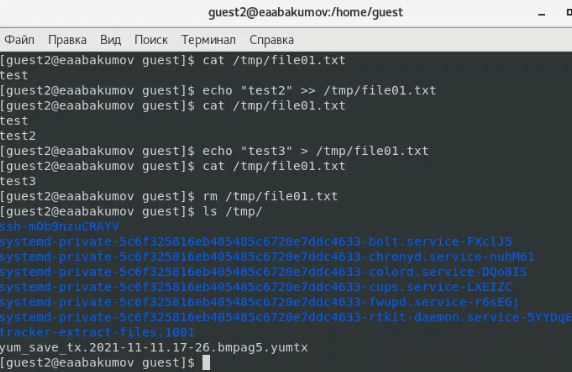{ #fig:019 width=73% }

# Выводы

В ходе работы мы успешно изучили механизмы изменения идентификаторов, применения SetUID-, SetGID- и Sticky-битов, получили практические навыки работы в консоли с дополнительными атрибутами, рассмотрели принципы работы механизма смены идентификатора процессов пользователей, а также влияние бита Sticky на запись и удаление файлов.

# Список литературы

1. Атрибуты файлов в Linux. // zalinux.ru. 2021. URL: https://zalinux.ru/?p=6440 (дата обращения 11.11.2021).

2. Команда chmod в Linux. // Losst. 2020. URL: https://losst.ru/komanda-chmod-linux (дата обращения 11.11.2021).

3. КОМАНДА CHATTR В LINUX. // Losst. 2020. URL: https://losst.ru/neizmenyaemye-fajly-v-linux (дата обращения 11.11.2021).

4. Д. С. Кулябов, А. В. Королькова, М. Н. Геворкян. Информационная безопасность компьютерных сетей: лабораторные работы. // Факультет физико-математических и естественных наук. M.: РУДН, 2015. 64 с..