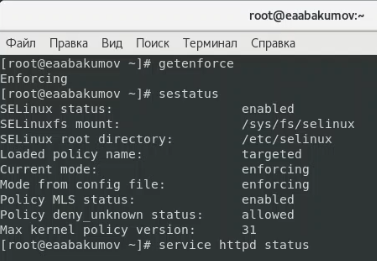
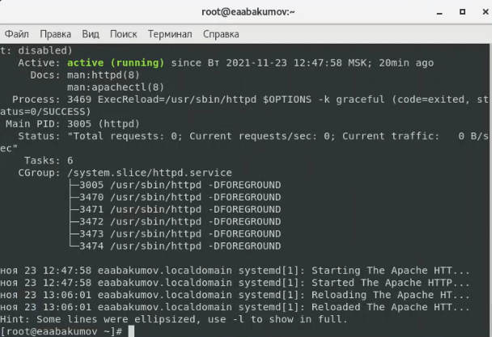
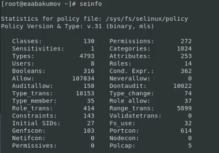
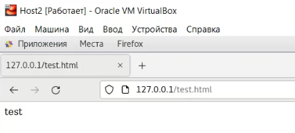
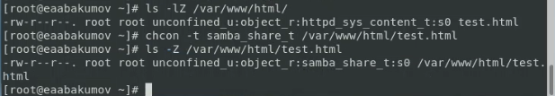
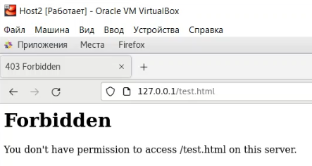
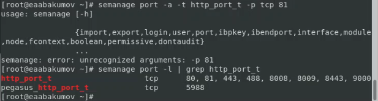
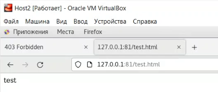

---
## Front matter
lang: ru-RU
title: "Лабораторная работа № 6"
subtitle: "Мандатное разграничение прав в Linux"
author: "Абакумов Егор Александрович"

## Formatting
toc: false
slide_level: 2
theme: metropolis
header-includes: 
 - \metroset{progressbar=frametitle,sectionpage=progressbar,numbering=fraction}
 - '\makeatletter'
 - '\beamer@ignorenonframefalse'
 - '\makeatother'
aspectratio: 43
section-titles: true
---

## Цель работы

Развить навыки администрирования ОС Linux. Получить первое практическое знакомство с технологией SELinux. Проверить работу SELinx на практике совместно с веб-сервером Apache.

# Ход работы

## Проверка состояния SELinux

{ #fig:001 width=72% }

## Проверка состояния демона httpd

{ #fig:002 width=72% }

## Статистика через seinfo

{ #fig:003 width=72% }

## Проверка доступа к файлу через браузер

{ #fig:004 width=72% }

## Изменение контекста безопасности файла

{ #fig:005 width=72% }

## Повторная проверка доступа к файлу через браузер

{ #fig:006 width=72% }

## Список доступных httpd портов

{ #fig:007 width=72% }

## Повторная проверка доступа к файлу браузером через 81-ый порт

{ #fig:008 width=72% }

## Вывод

В ходе работы мы успешно развили навыки администрирования ОС Linux, получили первое практическое знакомство с технологией SELinux и проверили работу SELinx на практике совместно с веб-сервером Apache.