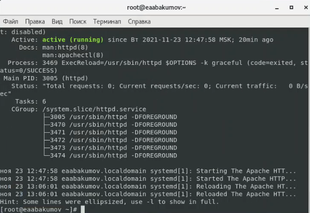
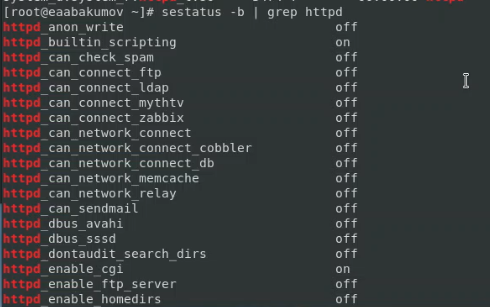
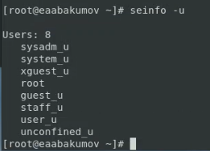
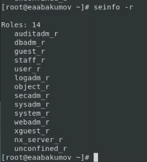
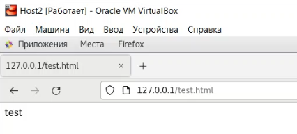
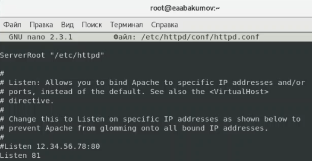

---
# Front matter
lang: ru-RU
title: "Лабораторная работа № 6"
subtitle: "Мандатное разграничение прав в Linux"
author: "Абакумов Егор Александрович"

# Formatting
toc-title: "Содержание"
toc: true
toc_depth: 2
lof: true
lot: true
fontsize: 12pt
linestretch: 1.5
papersize: a4paper
documentclass: scrreprt
polyglossia-lang: russian
polyglossia-otherlangs: english
mainfont: PT Serif
romanfont: PT Serif
sansfont: PT Sans
monofont: PT Mono
mainfontoptions: Ligatures=TeX
romanfontoptions: Ligatures=TeX
sansfontoptions: Ligatures=TeX,Scale=MatchLowercase
monofontoptions: Scale=MatchLowercase
indent: true
pdf-engine: lualatex
header-includes:
  - \linepenalty=10
  - \interlinepenalty=0
  - \hyphenpenalty=50
  - \exhyphenpenalty=50
  - \binoppenalty=700
  - \relpenalty=500
  - \clubpenalty=150
  - \widowpenalty=150
  - \displaywidowpenalty=50
  - \brokenpenalty=100
  - \predisplaypenalty=10000
  - \postdisplaypenalty=0
  - \floatingpenalty = 20000
  - \raggedbottom
  - \usepackage{float}
  - \floatplacement{figure}{H}
---

# Цель работы

Развить навыки администрирования ОС Linux. Получить первое практическое знакомство с технологией SELinux. Проверить работу SELinx на практике совместно с веб-сервером Apache.

# Теоретическое описание

SELinux представляет собой систему маркировки, каждый процесс имеет метку. Каждый файл, каталог или даже пользователь в системе имеет метку. Даже портам и устройствам и именам хостов в системе присвоены метки. SELinux определяет правила доступа процесса к объектам с определенными метками. Это и называется политикой. За соблюдением правил следит ядро. Иногда это еще называется обязательный контроль доступа (Mandatory Access Control, MAC). [1]

В дистрибутиве Linux MAC реализована поверх того, что мы называем моделью избирательного управления доступом (Discretionary Access Control), сокращённо DAC.

DAC – это управление доступом на основе списков управления доступом, где объектами доступа служат пользователь, группа и другие. Эти объекты имеют комбинацию полномочий чтение/запись/выполнение или r/w/x. SELinux позволяет ограничить доступ к объектам пользователя, который определён именно им так, что суперпользователь не может иметь суперпривилегии по отношению ко всем объектам нашего пользователя.

Другими словами, SELinux позволяет произвести точную настройку требований контроля доступа, с помощью которой определяется степень влияния пользователя на описанный настройкой процесс. Это в полной мере может предотвратить получение злоумышленником доступа ко всем объектам и процессам системы. [2]

Владелец файла не имеет полной свободы действий над атрибутами безопасности. Стандартные атрибуты контроля доступа, такие как группа и владелец ничего не значат для SELinux. Полностью все управляется метками. Значения атрибутов могут быть установлены и без прав root, но на это нужно иметь специальные полномочия SELinux.

# Ход работы

1. Готовим стенд. Для этого устанавливаем Apache, selinux command line tools и seinfo, дальше настраиваем ServerName в конфигурации httpd, разрешаем фильтру подключаться к 81-му порту. Делаем заранее за кадром.

2. Входим в систему и проверяем режим работы selinux (иллюстр. [-@fig:001]). Проверяем, что демон httpd включен и работает (иллюстр. [-@fig:002]). Находим процессы демона в списке и выписавем контекст: system_u:system_r:httpd_t:s0 (иллюстр. [-@fig:003]). Просматриваем переключатели selinux (иллюстр. [-@fig:004]). 

{ #fig:001 width=73% }

{ #fig:002 width=73% }

{ #fig:003 width=73% }

{ #fig:004 width=73% }

3. Утилитой seinfo выводим статистику по политике, множество пользователей, ролей и типов (иллюстр. [-@fig:005], [-@fig:006], [-@fig:007], [-@fig:008]).

{ #fig:005 width=73% }

{ #fig:006 width=73% }

{ #fig:007 width=73% }

{ #fig:008 width=73% }

4. Проверяем тип файлов и поддиректорий, находящихся в директории /var/www. Так как в директории лежат только поддиректории, их типы: httpd_sys_script_exec_t и httpd_sys_content_t. Пытаемся определить тип файлов в /var/www/html. Так как там нет файлов, определять нечего. Определяем круг пользователей, которым разрешено создание файлов в директории /var/www/html. Так как пользователь для директории установлен в system_u, создавать файлы там может только суперпользователь (иллюстр. [-@fig:009]).

{ #fig:009 width=73% }

5. Из-под рута создаем файл в /var/www/html/ (иллюстр. [-@fig:010]). Проверяем контекст: unconfined_u:object_r:httpd_sys_content_t:s0 (иллюстр. [-@fig:011]). Проверяем доступность файла в браузере (иллюстр. [-@fig:012]).

{ #fig:010 width=73% }

{ #fig:011 width=73% }

{ #fig:012 width=73% }

6. Изучив контексты файлов для httpd_selinux приходим к выводу, что контекст был выбран верно. Теперь изменим контекст (иллюстр. [-@fig:013]). Теперь браузер не имеет доступа к файлу, выдается ошибка (иллюстр. [-@fig:014]). Файл не был отображен, так как процесс httpd не имеет доступа к выбранному нами типу файла. Просматриваем логи, где говорится, что selinux запретил доступ из-за разницы в контекстах (иллюстр. [-@fig:015]).

{ #fig:013 width=73% }

{ #fig:014 width=73% }

{ #fig:015 width=73% }

7. Меняем порт прослушивания httpd с 80 на 81 (иллюстр. [-@fig:016]). Пытаемся перезапустить демона, он перезапускается, так как 81 порт прописан по дефолту в политике. В логах никаких ошибок не видим (иллюстр. [-@fig:017]). Выполняем добавление порта, на что selinux отказывается это делать, посколько порт уже прописан, проверяем это в списке (иллюстр. [-@fig:018]). Собственно, поэтому демон и перезапустился, хотя по задумке лабораторной работы не должен был, так как процесс попытался бы получить доступ к запрещенному порту, на что selinux не дал бы разрешения, а httpd, не стерпев такого обращения с собой, отказался бы запускаться, и только прописывание порта в selinux позволило бы выполнить перезапуск. Короче говоря, возвращаем верный контекст на файл test.html (иллюстр. [-@fig:019]) и проверяем его через 81-ый порт браузером (иллюстр. [-@fig:020]). Удаляем привязку порта, selinux отвечает, что порт прописан в политике, так что удаляться он не будет. Ну, мы его туда и не добавляли, так что кто мы такие, чтобы удалять его оттуда. Удаляем файл /var/www/html/test.html.

{ #fig:016 width=73% }

{ #fig:017 width=73% }

{ #fig:018 width=73% }

{ #fig:019 width=73% }

{ #fig:020 width=73% }

# Выводы

В ходе работы мы успешно развили навыки администрирования ОС Linux, получили первое практическое знакомство с технологией SELinux и проверили работу SELinx на практике совместно с веб-сервером Apache.

# Список литературы

1. НАСТРОЙКА SELINUX. // Losst. 2021. URL: https://losst.ru/nastrojka-selinux (дата обращения 23.11.2021).

2. Введение в SELinux под CentOS Stream // RUVDS. 2021. URL: https://ruvds.com/ru/helpcenter/vvedenie-v-selinux-pod-centos-stream/ (дата обращения 23.11.2021).

3. seinfo (1) // OpenNET. 2021. URL: https://www.opennet.ru/man.shtml?topic=seinfo&category=1&russian=2 (дата обращения 23.11.2021).

4. Д. С. Кулябов, А. В. Королькова, М. Н. Геворкян. Информационная безопасность компьютерных сетей: лабораторные работы. // Факультет физико-математических и естественных наук. M.: РУДН, 2015. 64 с..