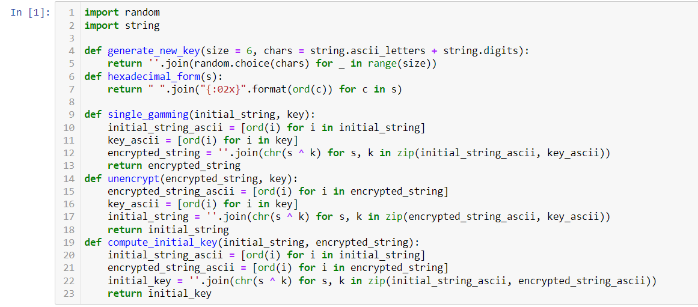
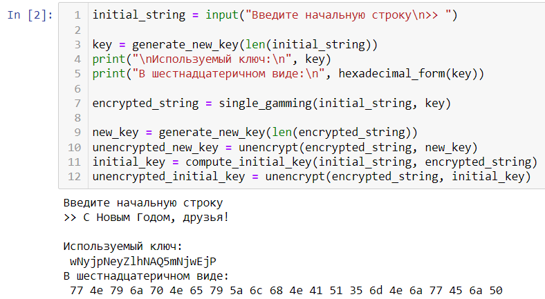
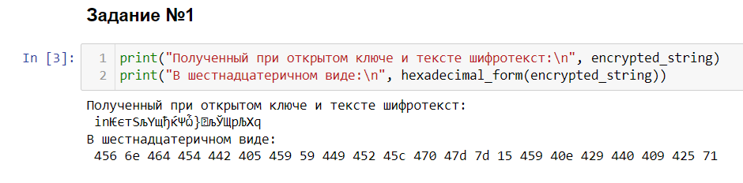
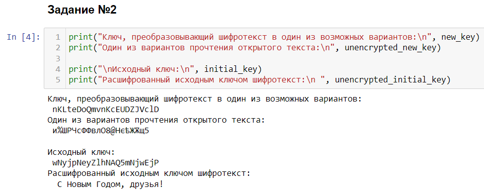

---
# Front matter
lang: ru-RU
title: "Лабораторная работа № 7"
subtitle: "Элементы криптографии. Однократное гаммирование"
author: "Абакумов Егор Александрович"

# Formatting
toc-title: "Содержание"
toc: true
toc_depth: 2
lof: true
lot: true
fontsize: 12pt
linestretch: 1.5
papersize: a4paper
documentclass: scrreprt
polyglossia-lang: russian
polyglossia-otherlangs: english
mainfont: PT Serif
romanfont: PT Serif
sansfont: PT Sans
monofont: PT Mono
mainfontoptions: Ligatures=TeX
romanfontoptions: Ligatures=TeX
sansfontoptions: Ligatures=TeX,Scale=MatchLowercase
monofontoptions: Scale=MatchLowercase
indent: true
pdf-engine: lualatex
header-includes:
  - \linepenalty=10
  - \interlinepenalty=0
  - \hyphenpenalty=50
  - \exhyphenpenalty=50
  - \binoppenalty=700
  - \relpenalty=500
  - \clubpenalty=150
  - \widowpenalty=150
  - \displaywidowpenalty=50
  - \brokenpenalty=100
  - \predisplaypenalty=10000
  - \postdisplaypenalty=0
  - \floatingpenalty = 20000
  - \raggedbottom
  - \usepackage{float}
  - \floatplacement{figure}{H}
---

# Цель работы

Освоить на практике применение режима однократного гаммирования.

# Теоретическое описание

Простейшей и в то же время наиболее надёжной из всех схем шифрования является так
называемая схема однократного использования, изобретение, которое чаще всего
связывают с именем Г.С. Вернама.

Гаммирование – это наложение (снятие) на открытые (зашифрованные) данные криптографической гаммы, т.е. последовательности элементов данных, вырабатываемых с помощью некоторого криптографического алгоритма, для получения зашифрованных (открытых) данных. С точки зрения теории криптоанализа, метод шифрования случайной однократной равновероятной гаммой той же длины, что и открытый текст, является невскрываемым. Кроме того, даже раскрыв часть сообщения, дешифровщик не сможет хоть сколько-нибудь поправить положение – информация о вскрытом участке гаммы не даёт информации об остальных её частях [1].

"Наложение" гаммы – не что иное, как выполнение операции сложения по модулю 2 (xor) её элементов с элементами открытого текста. Эта операция в в математике обозначается знаком $\oplus$.

Гаммирование является симметричным алгоритмом. Поскольку двойное прибавление одной и той же величины по модулю 2 восстанавливает исходное значение, шифрование и дешифрование выполняется одной и той же программой.

К. Шенноном было доказано, что если ключ является фрагментом истинно случайной двоичной последовательности с равномерным законом распределением, причём его длина равна длине исходного сообщения, и используется этот ключ только один раз, после чего уничтожается, то такой шифр является абсолютно стойким, даже если криптоаналитик располагает неограниченным ресурсом времени и неограниченным набором вычислительных ресурсов. Действительно, противнику известно только зашифрованное сообщение , при этом все различные ключевые последовательности возможны и равновероятны, а значит, возможны и любые сообщения , т.е. криптоалгоритм не даёт никакой информации об открытом тексте [2].

# Ход работы

1. В первую очередь оговоримся, что использовать будем среду Jupyter Notebook и язык программирования Питон. Для выполнения задания нам необходимо будет подключить библиотеки random и string. Пишем блок необходимых функций, которые и реализуют всю логику программы: функция generate_new_key принимает на вход длину требуемого ключа и возвращает случайную строку символов, что и будет являться ключом; функция hexadecimal_form возвращает шестнадцатиричный вид подаваемой на вход строки; функции single_gamming, unencrypt и compute_initial_key принимают на вход две строки и выполняют их посимвольное сложение по модулю 2 (иллюстр. [-@fig:001]).

{ #fig:001 width=73% }

2. Далее пишем блок расчетов всех необходимых параметров: initial_string получает с клавиатуры входную строку ("С Новым Годом, друзья!" в нашем случае); key - начальный используемый ключ; encrypted_string - первоначальный шифротекст; new_key - случайный ключ, используемый для получения варианта шифротекста; unencrypted_new_key - вариант текста, получаемый с помощью случайного ключа и изначального шифротекста; initial_key - начальный ключ, получаемый гаммированием открытого начального текста имеющимся шифротекстом; unencrypted_initial_key - расшифрованный вычисленным исходным ключом шифротекст (иллюстр. [-@fig:002]).

{ #fig:002 width=73% }

3. Пишем блок вывода данных для первого задания. Выводим на экран шифротекст, полученный однократным гаммированием исходной строки сгенерированным ключом (иллюстр. [-@fig:003])

{ #fig:003 width=73% }

4. Пишем блок вывода данных для второго задания. Выводим на экран случайный сгенерированный ключ, позволяющий вычислить один из вариантов расфишровки шифротекста, непосредственно сам вариант расшифровки, далее из шифротекста и исходной строки вычисляем и выводим исходный ключ и с его помощью выводим расшифрованный шифротекст (иллюстр. [-@fig:004])

{ #fig:004 width=73% }

# Выводы

В ходе работы мы успешно на практике освоили применение режима однократного гаммирования.

# Ответы на контрольные вопросы

1. Поясните смысл однократного гаммирования.
  * Гаммирование – это наложение (снятие) на открытые (зашифрованные) данные криптографической гаммы, то есть последовательности элементов данных, вырабатываемых с помощью некоторого криптографического алгоритма, для получения зашифрованных (открытых) данных. Однократное гаммирование – это когда каждый символ попарно с символом ключа складываются по модулю 2 (XOR) (обозначается знаком $\oplus$).

2. Перечислите недостатки однократного гаммирования.
  * Ключ должен быть того же размера, что и сообщение, нельзя кодировать два сообщения одним ключом 

3. Перечислите преимущества однократного гаммирования.
  * Невскрываемость при соблюдении требований и простота реализации.

4. Почему длина открытого текста должна совпадать с длиной ключа?
  * Потому что каждый символ сообщения должен быть закодирован попарным сложением по модулю два.

5. Какая операция используется в режиме однократного гаммирования, назовите её особенности?
  * XOR или "исключающее ИЛИ". Сложение по модулю 2. Особенность в симметричности - операция при повторном применении дает исходный результат. 

6. Как по открытому тексту и ключу получить шифротекст?
  * Сложить по модулю 2 каждый символ открытого текста и ключа.

7. Как по открытому тексту и шифротексту получить ключ?
  * Сложить по модулю 2 каждый символ открытого текста и шифротекста.

8. В чем заключаются необходимые и достаточные условия абсолютной стойкости шифра?
  1) случайность ключа;
  2) совпадение длины ключа и сообщения;
  3) однократное использование ключа.

# Список литературы

1. Шнайер, Б. Прикладная криптография. Протоколы, алгоритмы, исходные тексты на языке Си / Б. Шнайер. – М. : Триумф, 2002. – 816 с.

2. Харин, Ю.С. Математические и компьютерные основы криптологии : учебное пособие / Ю.С. Харин, В.И. Берник, Г.В. Матвеев, С.В. Агиевич. – Мн. : Новое знание, 2003. – 382 с.

3. Д. С. Кулябов, А. В. Королькова, М. Н. Геворкян. Информационная безопасность компьютерных сетей: лабораторные работы. // Факультет физико-математических и естественных наук. M.: РУДН, 2015. 64 с..