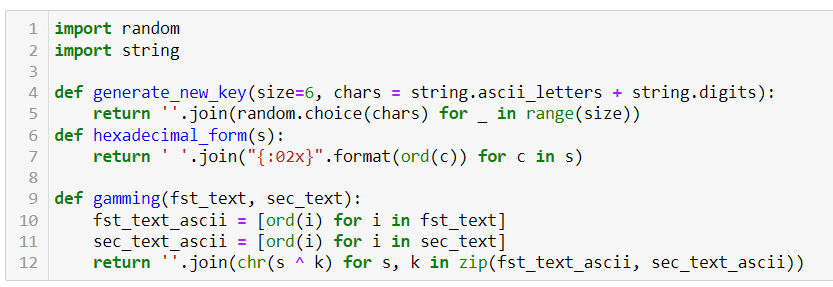
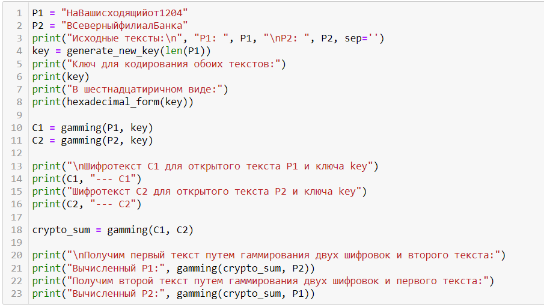
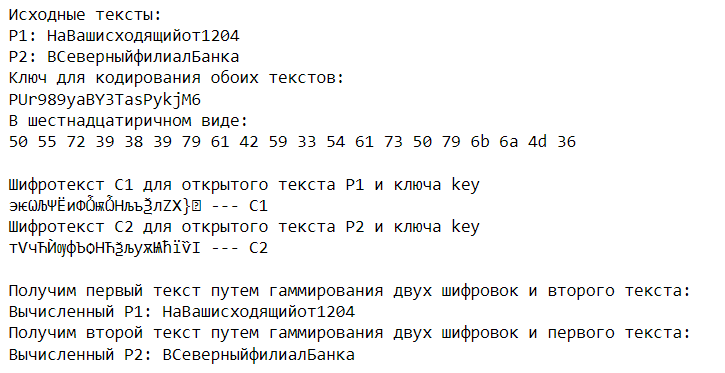

---
# Front matter
lang: ru-RU
title: "Лабораторная работа № 8"
subtitle: "Элементы криптографии. Шифрование (кодирование) различных исходных текстов одним ключом"
author: "Абакумов Егор Александрович"

# Formatting
toc-title: "Содержание"
toc: true
toc_depth: 2
lof: true
lot: true
fontsize: 12pt
linestretch: 1.5
papersize: a4paper
documentclass: scrreprt
polyglossia-lang: russian
polyglossia-otherlangs: english
mainfont: PT Serif
romanfont: PT Serif
sansfont: PT Sans
monofont: PT Mono
mainfontoptions: Ligatures=TeX
romanfontoptions: Ligatures=TeX
sansfontoptions: Ligatures=TeX,Scale=MatchLowercase
monofontoptions: Scale=MatchLowercase
indent: true
pdf-engine: lualatex
header-includes:
  - \linepenalty=10
  - \interlinepenalty=0
  - \hyphenpenalty=50
  - \exhyphenpenalty=50
  - \binoppenalty=700
  - \relpenalty=500
  - \clubpenalty=150
  - \widowpenalty=150
  - \displaywidowpenalty=50
  - \brokenpenalty=100
  - \predisplaypenalty=10000
  - \postdisplaypenalty=0
  - \floatingpenalty = 20000
  - \raggedbottom
  - \usepackage{float}
  - \floatplacement{figure}{H}
---

# Цель работы

Освоить на практике применение режима однократного гаммирования на примере кодирования различных исходных текстов одним ключом.

# Теоретическое описание

Простейшей и в то же время наиболее надёжной из всех схем шифрования является так
называемая схема однократного использования, изобретение, которое чаще всего
связывают с именем Г.С. Вернама.

Гаммирование – это наложение (снятие) на открытые (зашифрованные) данные криптографической гаммы, т.е. последовательности элементов данных, вырабатываемых с помощью некоторого криптографического алгоритма, для получения зашифрованных (открытых) данных. С точки зрения теории криптоанализа, метод шифрования случайной однократной равновероятной гаммой той же длины, что и открытый текст, является невскрываемым. Кроме того, даже раскрыв часть сообщения, дешифровщик не сможет хоть сколько-нибудь поправить положение – информация о вскрытом участке гаммы не даёт информации об остальных её частях [1].

"Наложение" гаммы – не что иное, как выполнение операции сложения по модулю 2 (xor) её элементов с элементами открытого текста. Эта операция в в математике обозначается знаком $\oplus$.

Гаммирование является симметричным алгоритмом. Поскольку двойное прибавление одной и той же величины по модулю 2 восстанавливает исходное значение, шифрование и дешифрование выполняется одной и той же программой.

К. Шенноном было доказано, что если ключ является фрагментом истинно случайной двоичной последовательности с равномерным законом распределением, причём его длина равна длине исходного сообщения, и используется этот ключ только один раз, после чего уничтожается, то такой шифр является абсолютно стойким, даже если криптоаналитик располагает неограниченным ресурсом времени и неограниченным набором вычислительных ресурсов. Действительно, противнику известно только зашифрованное сообщение , при этом все различные ключевые последовательности возможны и равновероятны, а значит, возможны и любые сообщения , т.е. криптоалгоритм не даёт никакой информации об открытом тексте [2].

# Ход работы

1. В первую очередь оговоримся, что использовать будем среду Jupyter Notebook и язык программирования Питон. Для выполнения задания нам необходимо будет подключить библиотеки random и string. Пишем блок необходимых функций, которые и реализуют всю логику программы: функция generate_new_key принимает на вход длину требуемого ключа и возвращает случайную строку символов, что и будет являться ключом; функция hexadecimal_form возвращает шестнадцатиричный вид подаваемой на вход строки; функция gamming будет выполнять основную роль - она выполняет непосредственно однократное гаммирование подаваемой строки с помощью ключа, передаваемого вторым аргументом (иллюстр. [-@fig:001]).

{ #fig:001 width=73% }

2. Теперь пишем блок обработки данных. Тут вводим переменные P1 и P2 для исходных текстов, переменную key для используемого ключа, C1 и С2 для шифротекстов P1 и Р2 соответственно, переменную crypto_sum для результата гаммирования двух шифротекстов между собой (иллюстр. [-@fig:002]).   

{ #fig:002 width=73% }

3. После запуска программы видим два исходных текста и ключ в символьной и шестнадцатиричной формах. После нам выводится оба шифротекста, получаемых гаммированием исходных текстов P1 и Р2 одним известным ключом key. Далее видим вычисляемые тексты Р1 и Р2 (иллюстр. [-@fig:003]). Вычисляются они с помощью суммы по модулю 2 обеих шифровок и одного из исходных текстов в соответствии с формулой: $C_1\oplus C_2\oplus P_1 = P_1\oplus P_2\oplus P_1 = P_2$. Таким образом, зная шифротексты и хотя бы часть одного из исходных текстов, можно расшифровать оба исходных текста. 

{ #fig:003 width=73% }

# Выводы

В ходе работы мы успешно на практике освоили применение режима однократного гаммирования на примере кодирования различных исходных текстов одним ключом.

# Ответы на контрольные вопросы

1. Как, зная один из текстов (P1 или P2), определить другой, не зная при этом ключа?
  * Для этого необходимо прогаммировать один шифротекст вторым, а после прогаммировать результат одним из исходных текстов. Таким образом мы получим другой исходный текст.

2. Что будет при повторном использовании ключа при шифровании текста?
  * Если речь о разных текстах, то мы создадим пару взаимосвязанных текстов, которые будут подвержены риску взлома при компроментации одного из исходных текстов. Если же речь об одном тексте, то мы из шифрованного текста обратно получим исходный нешифрованный.

3. Как реализуется режим шифрования однократного гаммирования одним ключом двух открытых текстов?
  * Поочередно гаммируем каждый текст одним ключом.

4. Перечислите недостатки шифрования одним ключом двух открытых текстов.
  * Подверженность взлому, шифр становится абсолютно вскрываемым. При утечке же хотя бы части одного из исходных текстов злоумышленник сможет расшифровать все тексты.

5. Перечислите преимущества шифрования одним ключом двух открытых текстов.
  * Можно сократить издержки по доставке ключей сторонам, либо вообще исключить их, если ключ использовать все время.

# Список литературы

1. Шнайер, Б. Прикладная криптография. Протоколы, алгоритмы, исходные тексты на языке Си / Б. Шнайер. – М. : Триумф, 2002. – 816 с.

2. Харин, Ю.С. Математические и компьютерные основы криптологии : учебное пособие / Ю.С. Харин, В.И. Берник, Г.В. Матвеев, С.В. Агиевич. – Мн. : Новое знание, 2003. – 382 с.

3. Д. С. Кулябов, А. В. Королькова, М. Н. Геворкян. Информационная безопасность компьютерных сетей: лабораторные работы. // Факультет физико-математических и естественных наук. M.: РУДН, 2015. 64 с..